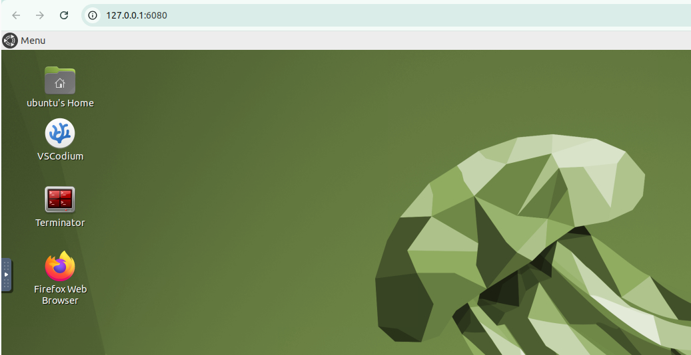
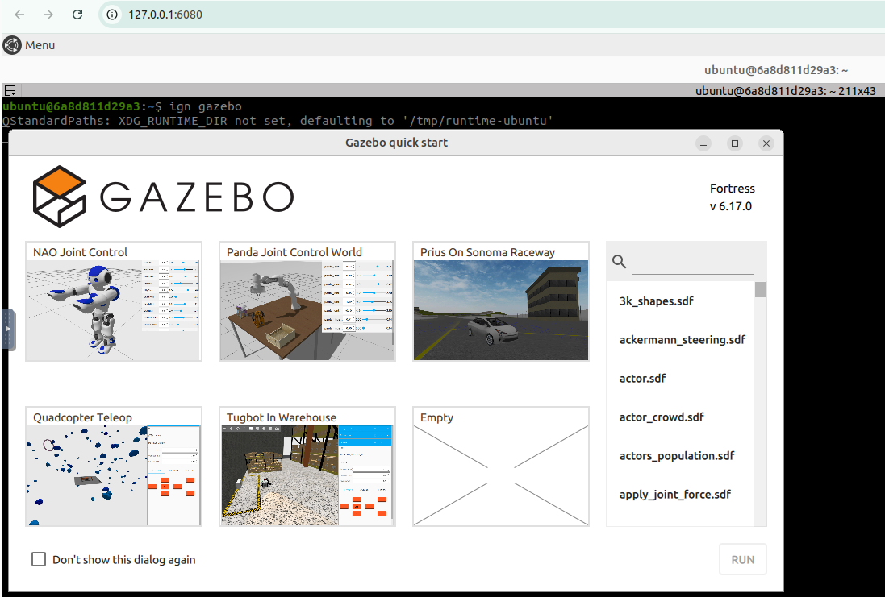

# Instalación

## TirYoh ROS2

La instalación se hará a partir de un repositorio que contiene una configuración de Docker para ejecutar un entorno de ROS2 con un escritorio virtual accesible mediante VNC, por lo que ROS2 ya estará instalado. También será necesario tener Docker en caso de que se vaya a usar.

Para lanzar el contenedor ejecutaremos lo siguiente:

```bash
docker run -p 6080:80 --security-opt seccomp=unconfined --shm-size=512m ghcr.io/tiryoh/ros2-desktop-vnc:humble
```

Se verá algo así:  


Ahora podremos acceder al contenedor desde un navegador en la página [http://127.0.0.1:6080/](http://127.0.0.1:6080/).  
Se verá algo así:  


Y ahora podremos comenzar con la instalación de **Gazebo**.

---

## Gazebo (Ignition Fortress)

Primero instalaremos algunas herramientas necesarias:

```bash
sudo apt-get update
sudo apt-get install lsb-release gnupg
```

Y ahora ya podremos instalar Ignition Fortress:

```bash
sudo curl https://packages.osrfoundation.org/gazebo.gpg --output /usr/share/keyrings/pkgs-osrf-archive-keyring.gpg
echo "deb [arch=$(dpkg --print-architecture) signed-by=/usr/share/keyrings/pkgs-osrf-archive-keyring.gpg] http://packages.osrfoundation.org/gazebo/ubuntu-stable $(lsb_release -cs) main" | sudo tee /etc/apt/sources.list.d/gazebo-stable.list > /dev/null
sudo apt-get update
sudo apt-get install ignition-fortress
```

Podemos comprobar que se ha instalado correctamente con:

```bash
ign gazebo
```

Que nos debería abrir la pantalla inicial de Gazebo, como se ve a continuación:  


---

## Turtlebot

Primero hay que instalar los siguientes paquetes de ROS2:

### Gazebo:

```bash
sudo apt install ros-humble-gazebo-*
```

### Cartographer:

```bash
sudo apt install ros-humble-cartographer
sudo apt install ros-humble-cartographer-ros
```

### Nav2:

```bash
sudo apt install ros-humble-navigation2
sudo apt install ros-humble-nav2-bringup
```

Una vez instalados hay que instalar los paquetes de TurtleBot3:

```bash
source /opt/ros/humble/setup.bash
mkdir -p ~/turtlebot3_ws/src
cd ~/turtlebot3_ws/src/
git clone -b humble https://github.com/ROBOTIS-GIT/DynamixelSDK.git
git clone -b humble https://github.com/ROBOTIS-GIT/turtlebot3_msgs.git
git clone -b humble https://github.com/ROBOTIS-GIT/turtlebot3.git
sudo apt install python3-colcon-common-extensions
cd ~/turtlebot3_ws
colcon build --symlink-install
echo 'source ~/turtlebot3_ws/install/setup.bash' >> ~/.bashrc
source ~/.bashrc
```

Una vez hecho esto, configuramos el entorno de la siguiente manera:

```bash
echo 'export ROS_DOMAIN_ID=30 #TURTLEBOT3' >> ~/.bashrc
echo 'source /usr/share/gazebo/setup.sh' >> ~/.bashrc
echo 'source /opt/ros/humble/setup.bash' >> ~/.bashrc
source ~/.bashrc
```

Para poder usar el paquete de simulación TurtleBot3 en Gazebo, añadimos un nuevo paquete a nuestro workspace:

```bash
cd ~/turtlebot3_ws/src/
git clone -b humble https://github.com/ROBOTIS-GIT/turtlebot3_simulations.git
cd ~/turtlebot3_ws && colcon build --symlink-install
```

Con esto ya tendremos todo instalado para poder usar TurtleBot3 en Gazebo.

---

## Gazebo Classic

Lanzamos el mundo de TurtleBot3:

```bash
export TURTLEBOT3_MODEL=burger
ros2 launch turtlebot3_gazebo turtlebot3_world.launch.py
```

Lanzamos el nodo de SLAM:

```bash
export TURTLEBOT3_MODEL=burger
ros2 launch turtlebot3_cartographer cartographer.launch.py use_sim_time:=True
```

Con esto se nos abrirá tanto Gazebo como RViz y podremos manejar el TurtleBot con el nodo de teleoperación:

```bash
export TURTLEBOT3_MODEL=burger
ros2 run turtlebot3_teleop teleop_keyboard
```

Podemos ver esto en funcionamiento en la siguiente imagen:  


Esto nos servirá para crear el mapa, el cual guardaremos después con el comando:

```bash
ros2 run nav2_map_server map_saver_cli -f ~/map
```

Una vez lo tengamos, podemos lanzar el nodo de navegación, al que le pasaremos el mapa:

```bash
export TURTLEBOT3_MODEL=burger
ros2 launch turtlebot3_navigation2 navigation2.launch.py use_sim_time:=True map:=$HOME/map.yaml
```

Una vez lanzado, tendremos que estimar la pose inicial como se ve en la imagen desde RViz:  


Y una vez hecho esto, podremos establecer una posición objetivo, por ejemplo desde RViz:  


Y veremos como el TurtleBot viaja hasta esa posición. Se puede ver cómo ocurre todo en el siguiente video:  
[Video de demostración](https://drive.google.com/file/d/1w9T3fVGo0hiLXVXU5Cwod1nkgd66f-Rd/view?usp=sharing)
