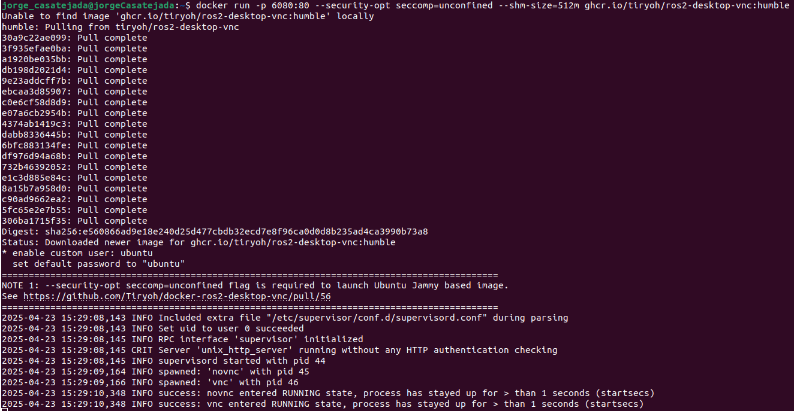

# Instalación

## TirYoh ROS2

La instalación se hará a partir de un repositorio que contiene una configuración de Docker para ejecutar un entorno de ROS2 con un escritorio virtual accesible mediante VNC, por lo que ROS2 ya estará instalado. También será necesario tener Docker en caso de que se vaya a usar.

Para lanzar el contenedor ejecutaremos lo siguiente:

```bash
docker run -p 6080:80 --security-opt seccomp=unconfined --shm-size=512m ghcr.io/tiryoh/ros2-desktop-vnc:humble
```

Se verá algo así:  


Ahora podremos acceder al contenedor desde un navegador en la página [http://127.0.0.1:6080/](http://127.0.0.1:6080/).  
Se verá algo así:  


Y ahora podremos comenzar con la instalación de **Gazebo**.

---

## Gazebo (Ignition Fortress)

Primero instalaremos algunas herramientas necesarias:

```bash
sudo apt-get update
sudo apt-get install lsb-release gnupg
```

Y ahora ya podremos instalar Ignition Fortress:

```bash
sudo curl https://packages.osrfoundation.org/gazebo.gpg --output /usr/share/keyrings/pkgs-osrf-archive-keyring.gpg
echo "deb [arch=$(dpkg --print-architecture) signed-by=/usr/share/keyrings/pkgs-osrf-archive-keyring.gpg] http://packages.osrfoundation.org/gazebo/ubuntu-stable $(lsb_release -cs) main" | sudo tee /etc/apt/sources.list.d/gazebo-stable.list > /dev/null
sudo apt-get update
sudo apt-get install ignition-fortress
```

Podemos comprobar que se ha instalado correctamente con:

```bash
ign gazebo
```

Que nos debería abrir la pantalla inicial de Gazebo, como se ve a continuación:  


---

## Turtlebot

Primero hay que instalar los siguientes paquetes de ROS2:

### Gazebo:

```bash
sudo apt install ros-humble-gazebo-*
```

### Cartographer:

```bash
sudo apt install ros-humble-cartographer
sudo apt install ros-humble-cartographer-ros
```

### Nav2:

```bash
sudo apt install ros-humble-navigation2
sudo apt install ros-humble-nav2-bringup
```

Una vez instalados hay que instalar los paquetes de TurtleBot3:

```bash
source /opt/ros/humble/setup.bash
mkdir -p ~/turtlebot3_ws/src
cd ~/turtlebot3_ws/src/
git clone -b humble https://github.com/ROBOTIS-GIT/DynamixelSDK.git
git clone -b humble https://github.com/ROBOTIS-GIT/turtlebot3_msgs.git
git clone -b humble https://github.com/ROBOTIS-GIT/turtlebot3.git
sudo apt install python3-colcon-common-extensions
cd ~/turtlebot3_ws
colcon build --symlink-install
echo 'source ~/turtlebot3_ws/install/setup.bash' >> ~/.bashrc
source ~/.bashrc
```

Una vez hecho esto, configuramos el entorno de la siguiente manera:

```bash
echo 'export ROS_DOMAIN_ID=30 #TURTLEBOT3' >> ~/.bashrc
echo 'source /usr/share/gazebo/setup.sh' >> ~/.bashrc
echo 'source /opt/ros/humble/setup.bash' >> ~/.bashrc
source ~/.bashrc
```

Para poder usar el paquete de simulación TurtleBot3 en Gazebo, añadimos un nuevo paquete a nuestro workspace:

```bash
cd ~/turtlebot3_ws/src/
git clone -b humble https://github.com/ROBOTIS-GIT/turtlebot3_simulations.git
cd ~/turtlebot3_ws && colcon build --symlink-install
```

Con esto ya tendremos todo instalado para poder usar TurtleBot3 en Gazebo.

---

## Gazebo Ignition

Para lanzar la simulación de TurtleBot3 en Ignition se hará uso del repositorio:  
[https://github.com/Onicc/navigation2_ignition_gazebo_turtlebot3](https://github.com/Onicc/navigation2_ignition_gazebo_turtlebot3)

Tendremos que instalar los siguientes paquetes (deberían estar ya instalados):

```bash
sudo apt install ros-humble-navigation2
sudo apt install ros-humble-nav2-bringup
sudo apt install ros-humble-ros-ign-gazebo
sudo apt install ros-humble-ros-ign-bridge
sudo apt install ros-humble-sdformat-urdf
```

Creamos un nuevo workspace:

```bash
mkdir -p ~/turtlebot3_ignition_ws/src
cd ~/turtlebot3_ignition_ws/src/
```

Clonamos el repositorio indicado anteriormente:

```bash
git clone https://github.com/Onicc/navigation2_ignition_gazebo_turtlebot3.git
```

Y hacemos `colcon build` al paquete:

```bash
cd ~/turtlebot3_ignition_ws && colcon build --symlink-install
```

Hacemos `source` del workspace:

```bash
source install/setup.bash
```

Ahora podemos lanzar la simulación de TurtleBot3 con Ignition:

```bash
ROS_LOCALHOST_ONLY=1 TURTLEBOT3_MODEL=waffle ros2 launch turtlebot3 simulation.launch.py
```

Se puede ver cómo inicia tanto el Ignition como el RViz, con Nav2 y SLAM, en la siguiente imagen:  


Se muestra el proceso completo en el siguiente video:  
[Video de simulación en Ignition](https://drive.google.com/file/d/1i2FNMm1GxFaXhm6FhWGwyWrt4mPbMg11/view?usp=sharing)
