# Instalación

## Comprobar requisitos
### Manera manual
Lo primero que haremos será comprobar que nuestro ordenador cumple con los requisitos mínimos para poder ejecutar este simulador, lo podremos hacer en la página [https://docs.isaacsim.omniverse.nvidia.com/4.5.0/installation/requirements.html](https://docs.isaacsim.omniverse.nvidia.com/4.5.0/installation/requirements.html).

Podemos comprobar la CPU y los cores con:

```
lscpu
```

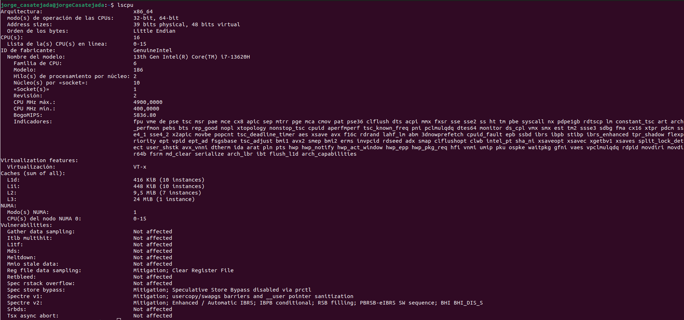

O más simple para el n.º de cores con:

```
nproc
```

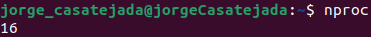

Para la memoria RAM podemos usar:

```
free -h
```

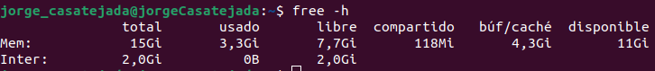

Para el almacenamiento podemos usar el comando:

```
df -h
```

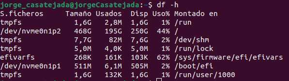

Para saber la GPU instalada, la VRAM y la versión del driver:

```
nvidia-smi
```

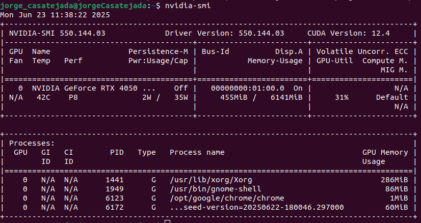

En mi caso no cumplo con los requisitos en RAM y VRAM:

| Elemento        | Mi PC                          | Mínimo                  | Bueno                   | Ideal                    |
|-----------------|--------------------------------|-------------------------|-------------------------|--------------------------|
| OS              | Ubuntu 22.04                   | ✅                      | ✅                      | ✅                       |
| CPU             | Intel Core i7-13620H (13ª Gen) | ✅ (supera)             | ✅ (supera)             | ❌ (por debajo de un i9 o equivalente) |
| Núcleos         | 16 (10 físicos / 6 virtuales HT) | ✅ (mínimo 4)          | ✅ (mínimo 8)          | ❌ (ideal 16 físicos)    |
| RAM             | 16 GB                          | ❌ (mínimo 32 GB)       | ❌ (64 GB recomendado)  | ❌ (ideal 64 GB o más)   |
| Almacenamiento  | 476 GB NVMe SSD                | ✅ (mínimo 50 GB SSD)   | ✅ (500 GB SSD recomendado) | ❌ (ideal 1 TB NVMe SSD) |
| GPU             | NVIDIA RTX 4050 (confirmada por ID 28a1) | ✅ (supera RTX 3070) | ✅ (inferior a 4080 pero suficiente) | ❌ (muy por debajo de Ada 6000) |
| VRAM            | 6 GB                           | ❌ (mínimo 8 GB recomendado) | ❌ (ideal 16 GB o más) | ❌ (muy lejos de los 48 GB ideales) |

### Haciendo uso de Isaac Sim Compatibility Checker
Podemos comprobar más fácilmente esto descargando el Isaac Sim Compatibility Checker desde [https://docs.isaacsim.omniverse.nvidia.com/4.5.0/installation/download.html#isaac-sim-latest-release](https://docs.isaacsim.omniverse.nvidia.com/4.5.0/installation/download.html#isaac-sim-latest-release), descomprimiendolo y ejecutándolo con:

```
./omni.isaac.sim.compatibility_check.sh
```

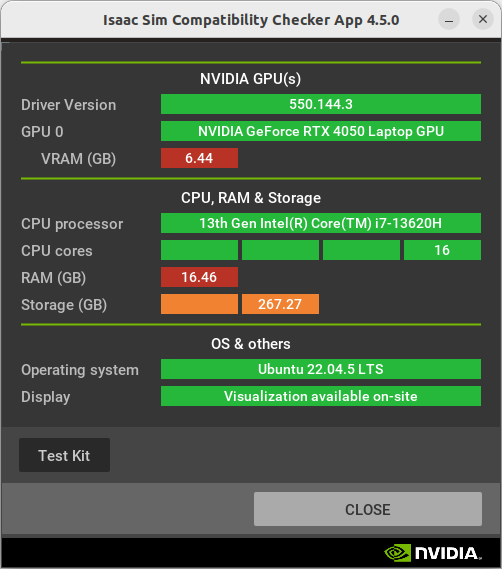

Igualmente continuaremos con la instalación ya que llega a funciona sin cumplir estos requisitos de RAM y VRAM para los ejemplos más básicos.

## Instalación Isaac Sim
Lo siguiente será descargar el propio simulador, Isaac Sim, desde la [página de descargas](https://docs.isaacsim.omniverse.nvidia.com/4.5.0/installation/download.html#isaac-sim-latest-release). Hay 3 opciones de ejecutar este simulador, en local, en un contenedor o en la nube, en mi caso se hará en local ya que es la manera recomendada para comenzar con el simulador.

Al tener instalado ROS2 de manera nativa solo hará falta instalar estos paquetes:

```
sudo apt install ros-humble-vision-msgs
sudo apt install ros-humble-ackermann-msgs
```

Y hacer source de ros 2:

```
source /opt/ros/humble/setup.bash
```

Una vez hecho esto seguiremos los [pasos de instalación](https://docs.isaacsim.omniverse.nvidia.com/4.5.0/installation/install_workstation.html) en los que tendremos que descomprimir el paquete en la carpeta raíz de Isaac Sim recomendada y ejecutar Isaac Sim App Selector, todo con el siguiente comando:

```
mkdir ~/isaacsim
cd ~/Descargas
unzip "isaac-sim-standalone@4.5.0-rc.36+release.19112.f59b3005.gl.linux-x86_64.release.zip" -d ~/isaacsim
cd ~/isaacsim
./post_install.sh
./isaac-sim.selector.sh
```

Una vez esto lanzado se abrirá el Isaac Sim App Selector y podremos iniciar el simulador seleccionando el ROS Bridge de ros2:

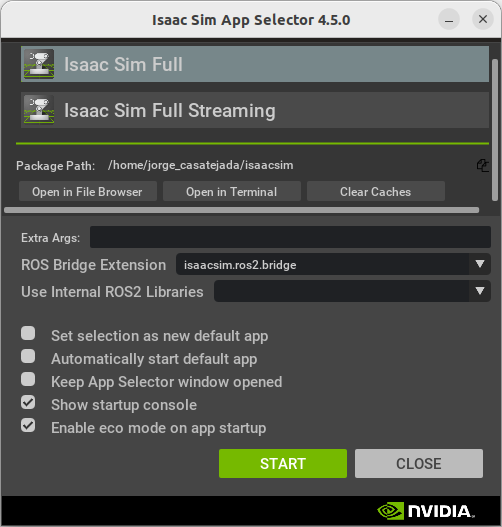

Y tras esperar unos 5 minutos tendremos el simulador iniciado, ya que el primer inicio es lento y sino el simulador no funcionará:

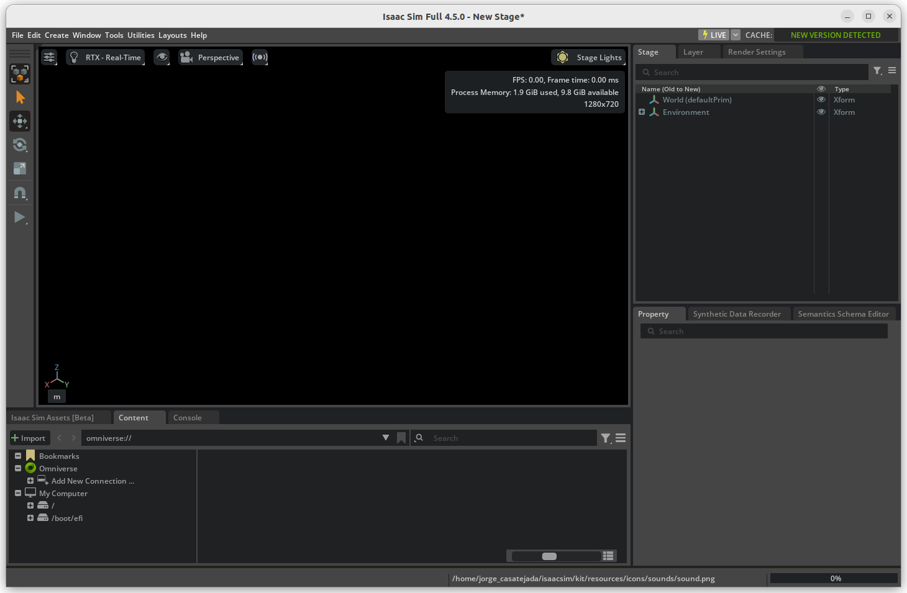

Una vez todo iniciado veremos algo así:

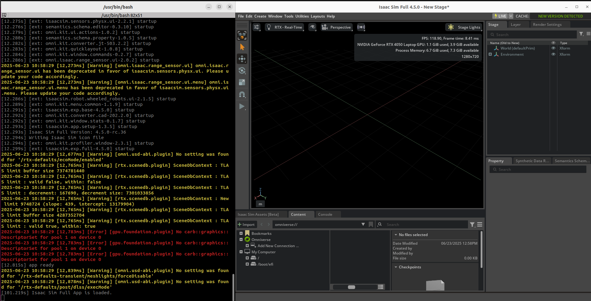

# Ejemplo ROS 2
Una vez vemos que funciona podemos probar el ejemplo de Isaac Sim con ROS 2, tendremos que ir a Window→Examples→Robotics Examples en el menú superior para habilitar una nueva sección de Robotics Examples en el menú inferior.

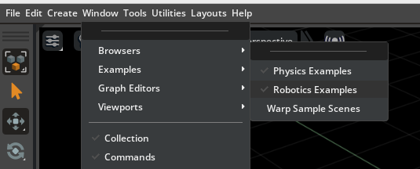

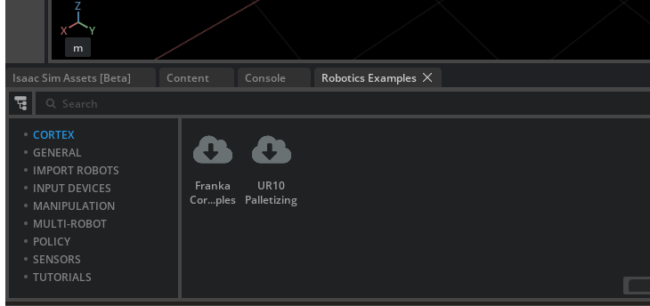

Ahora dentro de la pestaña Robotics Examples vamos a ROS2→ISAAC ROS y cargamos la escena de ejemplo.

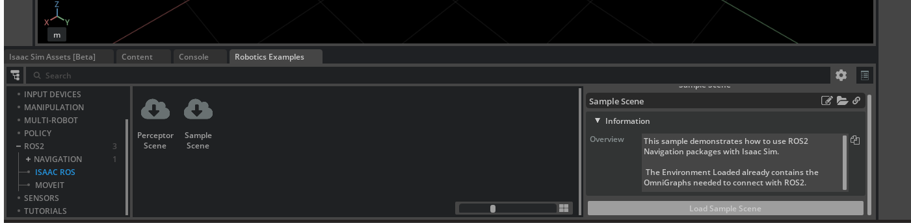

Esperamos a que cargue y podemos ver el ejemplo de simulación en el que se aprecia como el entorno simulado es bastante realista.

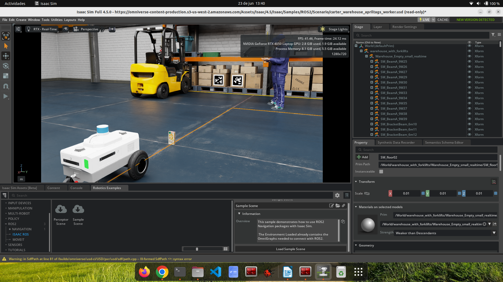

# Ejemplo ROS2 Nav2

## Instalación y Configuración del Workspace de Isaac Sim con ROS 2 Humble y Nav2

Para poder hacer uso de los ejemplo de Isaac Sim con ROS 2 y Nav2 tenemos que seguir los siguientes pasos, disponibles en su [página oficial](https://docs.isaacsim.omniverse.nvidia.com/4.5.0/installation/install_ros.html#setting-up-workspaces):

Primero instalamos los siguientes paquetes necesarios para hacer build del ws:

```
# For rosdep install command
sudo apt install python3-rosdep python3-rosinstall python3-rosinstall-generator python3-wstool build-essential
# For colcon build command
sudo apt install python3-colcon-common-extensions
```

Hacemos source de ROS 2:

```
source /opt/ros/humble/setup.bash
```

Clonamos el repositorio [https://github.com/isaac-sim/IsaacSim-ros_workspaces](https://github.com/isaac-sim/IsaacSim-ros_workspaces) que contiene 2 ws para humble y jazzy con un conjunto de paquetes de ejemplo listos para usar con Isaac Sim:

```
git clone https://github.com/isaac-sim/IsaacSim-ros_workspaces.git
```

Una vez clonado navegamos al ws de ROS 2 Humble:

```
cd IsaacSim-ros_workspaces/humble_ws/
```

Instalamos las dependencias necesarias de los paquetes ROS 2 que están dentro del workspace humble_ws:

```
rosdep install -i --from-path src --rosdistro humble -y
```

Puede que nos aparezca el siguiente error (este paquete o uno distinto):

```
jorge_casatejada@jorgeCasatejada:~/isaacsim/IsaacSim-ros_workspaces/humble_ws$ rosdep install -i --from-path src --rosdistro humble -y
executing command [sudo -H apt-get install -y ros-humble-pointcloud-to-laserscan]
Leyendo lista de paquetes... Hecho
Creando árbol de dependencias... Hecho
Leyendo la información de estado... Hecho
Se instalarán los siguientes paquetes NUEVOS:
  ros-humble-pointcloud-to-laserscan
0 actualizados, 1 nuevos se instalarán, 0 para eliminar y 17 no actualizados.
Se necesita descargar 251 kB de archivos.
Se utilizarán 1.421 kB de espacio de disco adicional después de esta operación.
Err:1 http://packages.ros.org/ros2/ubuntu jammy/main amd64 ros-humble-pointcloud-to-laserscan amd64 2.0.1-3jammy.20250429.205642
  404  Not Found [IP: 64.50.233.100 80]
E: Fallo al obtener http://packages.ros.org/ros2/ubuntu/pool/main/r/ros-humble-pointcloud-to-laserscan/ros-humble-pointcloud-to-laserscan_2.0.1-3jammy.20250429.205642_amd64.deb  404  Not Found [IP: 64.50.233.100 80]
E: No se pudieron obtener algunos archivos, ¿quizás deba ejecutar «apt-get update» o deba intentarlo de nuevo con --fix-missing?
ERROR: the following rosdeps failed to install
  apt: command [sudo -H apt-get install -y ros-humble-pointcloud-to-laserscan] failed
```

Si aparece, probablemte se repita para varios paquetes. Este error indica que el paquete ya no está disponible en los repositorios binarios de ROS 2 Humble, probablemente porque el paquete ha sido retirado o ha cambiado de versión y los índices locales no están actualizados.

En mi caso los paquetes con error fueron:
- pointcloud_to_laserscan
- ros-humble-moveit-resources-panda-moveit-config
- ros-humble-topic-based-ros2-control
- picknik_ament_copyright
- ros-humble-ros-testing
- ros-humble-ros2test
- rosidl_core_runtime
- ros-humble-test-interface-files 

Para solucionarlo los podemos instalar desde fuente con los siguientes pasos:

Clonamos los repositorios:

```
cd ~/isaacsim/IsaacSim-ros_workspaces/humble_ws/src
git clone -b humble https://github.com/ros-perception/pointcloud_to_laserscan.git
git clone -b humble https://github.com/ros-planning/moveit_resources.git
git clone https://github.com/PickNikRobotics/topic_based_ros2_control.git
git clone https://github.com/ros2/ros_testing.git
git clone https://github.com/ros2/rcl_interfaces.git
git clone https://github.com/ros2/rosidl_core.git
git clone https://github.com/ros2/test_interface_files.git
```

Instalamos las dependendencias:

```
rosdep install -i --from-path src --rosdistro humble -y
```

Después hacemos colcon build del ws:

```
colcon build
```

Y hacemos source del ws para poder hacer uso del mismo:

```
source install/local_setup.bash
```

## Ejemplo Nav2 con robot Nova Carter

Lanzamos el simulador y tendremos que ir a Window→Examples→Robotics Examples en el menú superior para habilitar una nueva sección de Robotics Examples en el menú inferior.


Ahora dentro de la pestaña Robotics Examples vamos a ROS2→NAVIGATION→ CARTER y cargamos la escena de ejemplo.

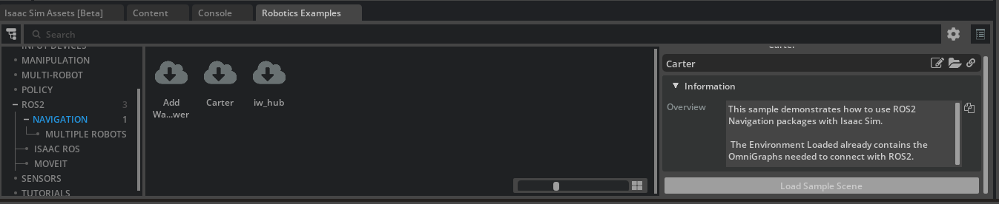

Una vez se cargue la damos al botón Play de la izquiera para comenzar la simulación:

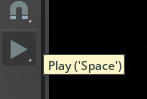

Si aparece un error del estilo:

```bash
CUDA Driver CALL FAILED at line 522: the provided PTX was compiled with an unsupported toolchain.
[Error][omni.sensors.nv.lidar.lidar_core.plugin] CUDA Driver CALL FAILED at line 548: named symbol not found
[Error][omni.sensors.nv.lidar.lidar_core.plugin] CUDA Driver CALL FAILED at line 259: invalid resource handle
```

Tendremos que cambiar el driver y la version de CUDA toolkit, como se comenta en [este foro](https://forums.developer.nvidia.com/t/help-with-cuda-driver-call-failed-error-in-isaacsim-4-5-0/334071). Seguiremos estos pasos:

1. Limpiar instalaciones previas, eliminando cualquier controlador o paquete CUDA anterior para evitar conflictos:

```bash
sudo apt purge 'nvidia*' 'cuda*' -y
sudo rm /etc/apt/sources.list.d/cuda* 
sudo apt autoremove -y && sudo apt autoclean -y
sudo rm -rf /usr/local/cuda*
```

2. Agregar repositorio de controladores NVIDIA e instalar las herramientas necesarias y añadir el PPA oficial:

```bash
sudo apt update
sudo apt install build-essential gcc make -y
sudo add-apt-repository ppa:graphics-drivers/ppa
sudo apt update
```

3. Instalar controlador NVIDIA 570 y el paquete principal como DKMS:

```bash
sudo apt install nvidia-driver-570 nvidia-dkms-570 -y
sudo reboot
```

Después del reinicio, verificamos los cambios con:

```bash
nvidia-smi
```

Se debería ver algo como: Driver Version: 570.xxx y CUDA Version: 12.8.

Una vez solucionado esto repetimos el paso anterior de lanzar el ejemplo y la simulación de Nav2 con el robot Nova Carter y en una terminal con el ws de humble abierto lanzaremos el siguiente comando para lanzar Nav2 en el ejemplo:

```
ros2 launch carter_navigation carter_navigation.launch.py
```

Esto hará que Rviz se abra y se comience a cargar el mapa y una vez cargado podemos enviar un Goal de Nav2 al robot para que navegue.

Se muestra el proceso completo en el siguiente video:

[IsaacVideo.webm](https://github.com/user-attachments/assets/eea1e320-5715-4e01-840a-5faba5027bae)

[Video de simulación en IsaacSim](https://drive.google.com/file/d/1ncqji2OPv3vQ5_iqrpa1x-kX7DWHYLxt/view?usp=sharing)
