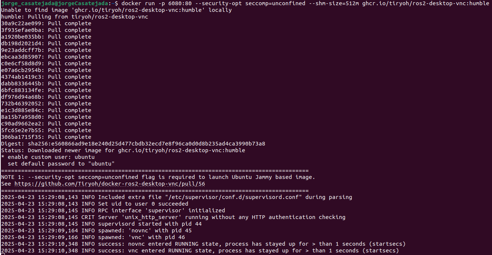
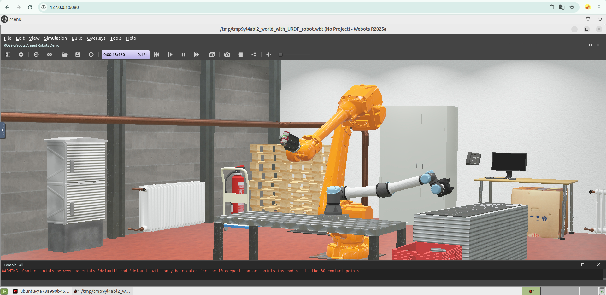
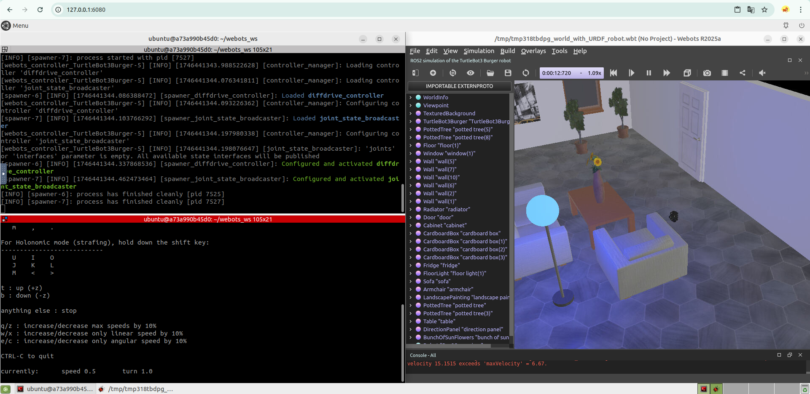
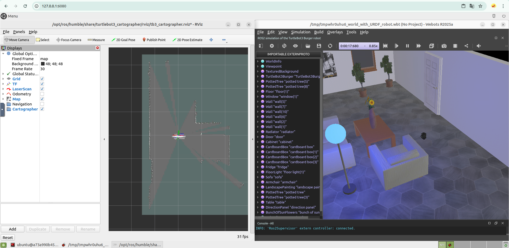

# Instalación

## TirYoh ROS2

La instalación se hará a partir de un repositorio que contiene una configuración de Docker para ejecutar un entorno de ROS2 con un escritorio virtual accesible mediante VNC, por lo que ROS2 ya estará instalado. También será necesario tener Docker en caso de que se vaya a usar.

Para lanzar el contenedor ejecutaremos lo siguiente:

```bash
docker run -p 6080:80 --security-opt seccomp=unconfined --shm-size=512m ghcr.io/tiryoh/ros2-desktop-vnc:humble
```

Se verá algo así:  


Ahora podremos acceder al contenedor desde un navegador en la página:  
[http://127.0.0.1:6080/](http://127.0.0.1:6080/)  
Se verá algo así:  


Y ahora podremos comenzar con la instalación de **Webots ROS 2**.

---

## Webots (R2025a) ROS 2

Primero creamos un workspace de ROS2 con su carpeta `src`:

```bash
mkdir -p ~/webots_ws/src
```

Hacemos un `source` del entorno:

```bash
source /opt/ros/humble/setup.bash
```

Navegamos a la raíz del directorio y clonamos el repositorio de Webots ROS 2:

```bash
cd ~/webots_ws
git clone --recurse-submodules https://github.com/cyberbotics/webots_ros2.git src/webots_ros2
```

Una vez hecho esto, instalamos las dependencias del paquete con:

```bash
sudo apt update
sudo apt install python3-pip python3-rosdep python3-colcon-common-extensions
rosdep update
rosdep install --from-paths src --ignore-src --rosdistro humble
```

Y hacemos el `colcon build` del paquete:

```bash
colcon build
```

Para usarlo, hacemos `source` del workspace:

```bash
source install/local_setup.bash
```

Podemos comprobar que se ha instalado correctamente lanzando el ejemplo de `webots_ros2_universal_robot` con:

```bash
ros2 launch webots_ros2_universal_robot multirobot_launch.py
```

Esto nos debería abrir el simulador de Webots con el ejemplo en funcionamiento, como se ve a continuación:  


---

## Turtlebot

### Teleop

Podemos usar el ejemplo de Webots Turtlebot directamente con:

```bash
ros2 launch webots_ros2_turtlebot robot_launch.py
```

Y controlar el robot con:

```bash
ros2 run teleop_twist_keyboard teleop_twist_keyboard
```

Esto lo podemos ver en la siguiente imagen:  


---

### SLAM

Por otra parte, para poder hacer uso de SLAM con Turtlebot primero tendremos que instalar Cartographer:

```bash
sudo apt install ros-humble-turtlebot3-cartographer
```

Una vez instalado, lo podremos lanzar con:

```bash
ros2 launch webots_ros2_turtlebot robot_launch.py slam:=true
```

Este comando abre tanto el simulador Webots como RViz, y podemos verlo en la siguiente imagen:  


---

### NAV2

Por último, para poder usar NAV2 con Turtlebot tendremos que instalar Navigation2:

```bash
sudo apt install ros-humble-turtlebot3-navigation2
```

Y podremos lanzar el Turtlebot con NAV2 con:

```bash
ros2 launch webots_ros2_turtlebot robot_launch.py nav:=true
```

Se muestra el proceso completo en el siguiente video:

[WebotsVideo.webm](https://github.com/user-attachments/assets/039a71ad-05ca-4e6a-9d97-3682d715ff75)

[Video de simulación en Webots](https://drive.google.com/file/d/1v1eEK31NI5DHpot0LFUTxuvDAyhIwg_7/view?usp=sharing)
